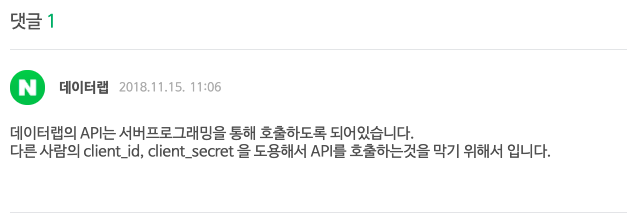
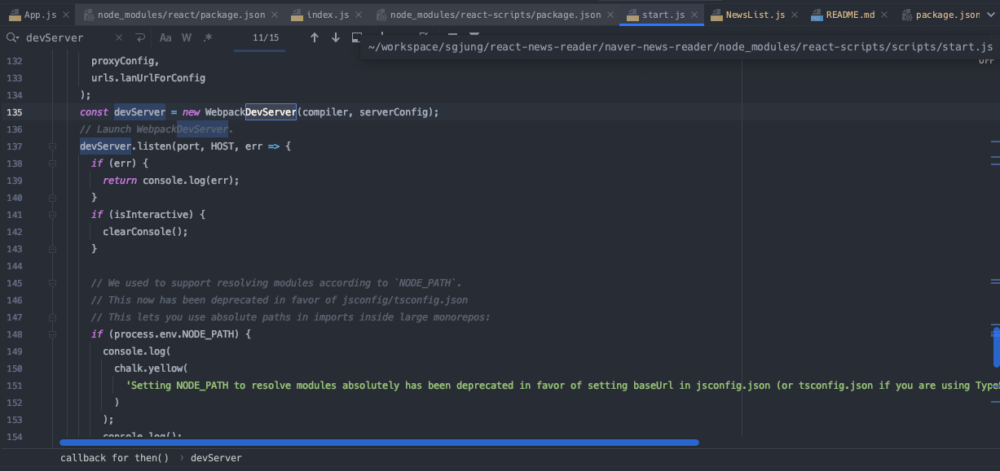
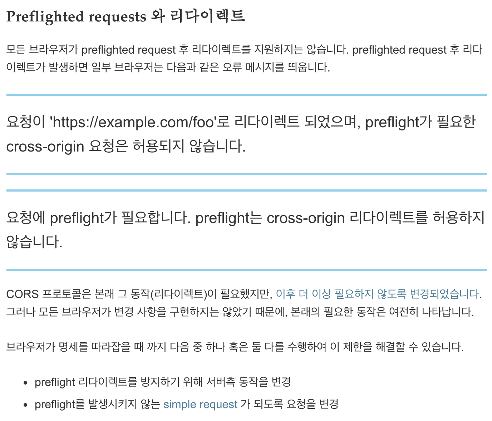

# 프로젝트 목표

lognomy 에는 아래의 기능들을 제공하려 한다. 
- 차트메뉴
- 일간 키워드 검색 뉴스 메뉴

이번 프로젝트에서는 일간 키워드 검식 뉴스 메뉴를 위한 라우터/state 코드를 작성할 예정이다.  
react hooks api, 함수형 컴포넌트, useEffect, useState 등의 기능을 활용해 최신 버전의 react 기능들을 적용해보는게 목표이다.     

# 현재 진행 상황
## 2020/10월 셋째주
파라미터 바인딩 된 1단구조 라우터를 작성했다. 아직은 styled component, 2단 구조 라우팅(차트 컴포넌트 연동을 위한 기능) 등등 해야 할 것들이 많다.

## 2020/10월 둘째주
CSS 와 UI의 대강의 구조를 잡았다.

# 참고자료 (Trouble Shooting 등등)
## 2020/10월 셋째주 주말
### 네이버 뉴스검색 API
네이버 뉴스 검색 API의 정책은 서버프로그래밍을 통해서만 호출하도록 되어있다. ([관련자료](https://developers.naver.com/forum/posts/26989))

### Access-Control-Allow-Origin
참고자료
 - [stackoverflow - Access-Control-Allow-Origin is a response header](https://stackoverflow.com/questions/45975135/access-control-origin-header-error-using-axios-in-react-web-throwing-error-in-ch)  
   - {Access Control Allow Origin : "*"} 가 response header에 심어져 있어야 한다. 
   - yarn start 등과 같은 명령어로는 response를 심을 수가 없고, Spring, Node.js, Django 등을 이용하거나 또는 Java, Python 등을 이용해 
   간단한 서버를 구현해 Response 에 Access-Control-Allow-Origin 을 심어주어야 한다. 
   - 단순히 client (yarn start 또는 파일기반 html 파일내의 js)에서 요청을 보낼때는 response header를 만들어내는 것이 불가능하다.
 - 그럼 서버(cors 세팅을 한 서버)를 거치지 않고서는 정말 방법이 없는 것일까? 아니다. 개발버전에서도 우회하는 방법이 있기는 하다.
   - [Webpack Dev Server 로 리버스 프록싱하기](https://evan-moon.github.io/2020/05/21/about-cors/#webpack-dev-server%EB%A1%9C-%EB%A6%AC%EB%B2%84%EC%8A%A4-%ED%94%84%EB%A1%9D%EC%8B%B1%ED%95%98%EA%B8%B0)
 - 이 외에 읽어볼 만한 자료들
   - [가장 정석적인 방법 = 서버에서 세팅](https://evan-moon.github.io/2020/05/21/about-cors/#access-control-allow-origin-%EC%84%B8%ED%8C%85%ED%95%98%EA%B8%B0)  
   - [Webpack Dev Server로 리버스 프록싱하기](https://evan-moon.github.io/2020/05/21/about-cors/#webpack-dev-server%EB%A1%9C-%EB%A6%AC%EB%B2%84%EC%8A%A4-%ED%94%84%EB%A1%9D%EC%8B%B1%ED%95%98%EA%B8%B0)  
   -   
   - [우회할수 있는 그런 방법들...을 이야기하긴하는데 하지 말자 ㅋㅋ;;](https://kamang-it.tistory.com/entry/Web%EB%8F%99%EC%9D%BC-%EC%B6%9C%EC%B2%98-%EC%A0%95%EC%B1%85-CORS-%EB%8F%84%EB%8C%80%EC%B2%B4-%EB%AD%98%EA%B9%8C)

### Preflighted requests와 리다이렉트 ([관련자료](https://developer.mozilla.org/ko/docs/Web/HTTP/CORS))
OPTINS 로 한번씩 더 요청하는 경우가 있는데 이 경우에 대한 설명.

